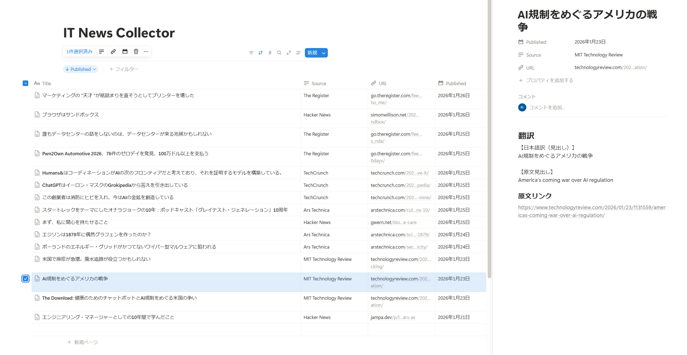

## IT News Collector

英語が得意ではない中でも海外の技術記事を効率よく追うために、  
バイブコーディングで作った IT ニュース収集ツールです。  
海外の IT メディアから記事を取得し、日本語に翻訳した上で Notion に自動保存します。

※ 現段階ではタイトルのみを翻訳しています。記事本文については、取得方法や運用を試しながら今後検討する予定です。

---

## 主な機能
- 海外IT・技術系ニュースサイトの RSS を定期取得
- 各媒体のトップニュースを３件ずつ取得
- 記事タイトルを日本語に翻訳して Notion に保存
- 既に登録済みの記事は重複登録しない
- GitHub Actions による自動実行（毎日定時＋手動実行）

---

## 取得する情報

現在は、以下の情報を取得しています。

- 記事タイトル（日本語翻訳）
- ソース媒体（掲載元メディア名）
- 記事URL
- 公開日

※ 記事本文や要約については、今後の検討対象としています。

---

## 収集メディア
- Hacker News（開発者コミュニティ発：スタートアップ／OSS／技術トレンドの一次情報）
- Ars Technica（深掘り系テックメディア：OS・セキュリティ・インフラ・ハードウェアに強い）
- TechCrunch（ITビジネス／スタートアップ動向：資金調達・企業ニュース寄り）
- The Register（実務・インフラ・業界ゴシップ：運用／クラウド／企業ITの現実的な話題）
- MIT Technology Review（研究・AI・未来技術寄り：論文背景や長期的インパクトを解説）[2026/02/01 削除]
- Google AI Blog（研究・AI・未来技術寄り：Googleの一次研究・実装事例）[2026/02/01 追加]

※ 運用しながら必要に応じて、メディアの追加・変更する可能性があります。

---

## 技術構成
- Python
- GitHub Actions（定期実行・自動化）
- Notion API（データベース保存）
- DeepL API（英日翻訳）
- feedparser / requests（RSS取得・外部API通信）
